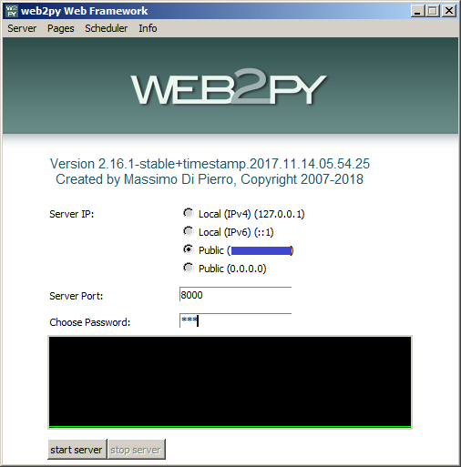
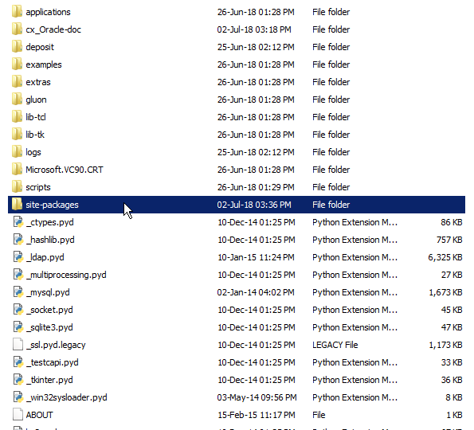
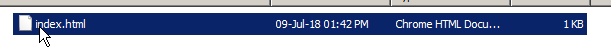

# Table of contents
1. [How to start](#p0)
2. [Directories](#p1)
3. [Stuff needed(libraries/packages)](#p2)
4. [How Web2py works](#p3)
    * [Controllers](#s1p3)
    * [Views](#s2p3)
    
## How to start <a name="p0"></a>
In `S:\Expl_is\Macarie\Program\web2py` run `web2py.exe` on either ip its user's choice.

With any password that user desires example: `123`.


Then in:
>My Sites 


>Cnas 


>

> 


## Directories <a name="p1"></a>:
- `f` - foreignlist dumper
- `d` - deadlist dumper
- `S:\Expl_is\Macarie\Program\web2py\webpy.exe` - New py2web server starter.

## Stuff needed(libraries/packages) <a name="p2"></a>
- *Python 2.7*
- *cx_Oracle Library* + *Oracle instant client* 
  - cx_Oracle-doc contains the *Oracle instant client*  

Inside site-packages is where we place all the additional libraries/packages we are using in our web2py python code.



## How Web2py works <a name="p3"></a>
In `S:\Expl_is\Macarie\Program\web2py\applications` is where are the web interfaces deployed.


In `S:\Expl_is\Macarie\Program\web2py\applications\cnas` is the web interface for CNAS dead and foreign list repartition.
- The '*controllers*' is the directory that responds for the backend.
- The '*views*' is the directory that responds for the frontend.
 


### Controllers <a name="s1p3"></a>
`S:\Expl_is\Macarie\Program\web2py\applications\cnas\controllers`


Each `.py` program responds for the responsiveness of each page in '*views*'.


`deadlist.py`and `foreignlist.py` have similar code therefor i will explain only `foreignlist.py`

The main functions that we must pay attention inside `foreignlist.py` are 


* `index()` - responds for the session variables
* `processing()` - responds for the authentication with both databases,selection and insertion of data.
* `succes()` - responds for the succes page if the `processing()` run was perfect.
* `error()` - responds for the connection with `REGISTRU`
* `error2()` - responds for the connection with `CNAS`

```python3
def index():
    if request.vars.selector1 and request.vars.selector2:
        session.month = request.vars.selector1
        session.year = request.vars.selector2
        session.dbf = request.vars.option1
        redirect(URL('processing'))
    return dict()


def processing():  # !!!!!!!!!!!!!! MAIN FUNCTION!!!!!!!!!!!!!!!!
    print 'BEGIN'
    s = time.time()
    try:
        authentication()
        ids = request_idnps(session.month, session.year)
        print 'Authentication passed'
        ##        if session.dbf=='OK':
        ##        	copy_to_dbf(ids)
        #    DB_results = choosing_idnps(ids)
        #    idnps = []
        #    print "Get Results from OracleBD"
        #    for x in DB_results:
        #    	idnps.append(x[0])
        #    fio_register, bdays, ddays = request_personal_data(idnps)
    except:
        print "Connection failed"
        print 'FINISH ' + str(time.time() - s) + "\n"
        redirect(URL('error'))
        #   length = len(idnps)
        #   for i in range(length):
        #   	DB_results[i].append(fio_register[i])
        #   	DB_results[i].append(bdays[i])
        #   	DB_results[i].append(ddays[i])
        #   DB_results.sort(key=lambda x: x[4])
        #   print "Data sorted"

    try:
        # connection to the database
        db = DB()
        # the insert query
        QUERY = 'Insert Into DEI.FOREIGNER_idnp (IDNP,TECH_DATE,INIT_DATE) values (:1, :2, :3)'
        db.insert(QUERY, parser(ids, int(session.month), int(session.year)))
        print 'Authentication passed - Targeted Database'
    except:
        print "Connection failed"
        print 'FINISH ' + str(time.time() - s) + "\n"
        redirect(URL('error2'))
    '''
    QUERY2 = 'SELECT * FROM DEI.FOREIGNER_idnp'
    result = db.query(QUERY2)
    from pprint import pprint
    pprint(result)
    '''
    # writing to txt files in the location
    write_idnps_in_file(ids, session.month, session.year)

    print 'FINISH ' + str(time.time() - s) + "\n"
    redirect(URL('succes'))
    return dict()


def succes():
    return dict()


def error():
    return dict()


def error2():
    return dict()
```

### Views <a name="s2p3"></a>
In `S:\Expl_is\Macarie\Program\web2py\applications\cnas\views\default` is the default main page of `CNAS`.



In `S:\Expl_is\Macarie\Program\web2py\applications\cnas\views\foreignlist` we can see the pages of 
the functions that we saw in the [Controllers](#s1p3) respectively.


The `deadlist` is similar to `foreignlist`

